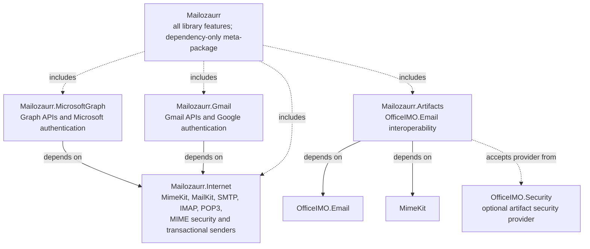
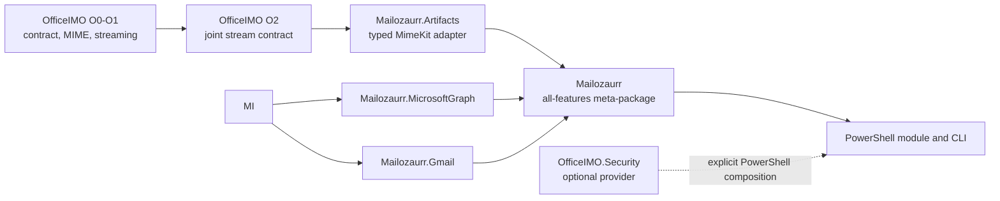

# Mailozaurr and OfficeIMO.Email Architecture Plan

Status: local implementation and product validation are complete; pull-request, live-provider, release, and public-feed gates remain open.

This plan defines the target package model, ownership boundaries, migration order, compatibility policy, validation gates, and release order for Mailozaurr and its OfficeIMO.Email integration.

The design serves two different installation experiences:

- PowerShell and CLI users receive one batteries-included product with every supported provider and artifact workflow.
- C# users may install `Mailozaurr` for everything or select smaller packages that avoid unrelated provider and artifact dependencies.

## Decisions

- `Mailozaurr` becomes the all-library-features NuGet meta-package.
- The initial public implementation packages are limited to `Mailozaurr.Internet`, `Mailozaurr.MicrosoftGraph`, `Mailozaurr.Gmail`, and `Mailozaurr.Artifacts`.
- `Mailozaurr.Application` is retired. CLI/MCP workflow composition is an internal, non-packable `Mailozaurr.Host` assembly; it is not another public C# package.
- There is no initial public `Mailozaurr.Core`, `Mailozaurr.Workflows`, `Mailozaurr.Mime`, `Mailozaurr.Protocols`, or `Mailozaurr.Transactional` package.
- MimeKit and MailKit remain the Internet-message and standard-protocol engines. OfficeIMO.Email does not replace them.
- OfficeIMO.Email remains the owner of persisted email and Outlook artifacts, including its native MIME/EML reader and writer.
- `Mailozaurr.Artifacts`, rather than `Mailozaurr.OfficeIMO`, is the user-facing integration package.
- OfficeIMO.Security remains an optional concrete security provider for artifact verification and decryption. It does not replace MimeKit security.
- PowerShell and CLI compose the implementation packages explicitly. The `Mailozaurr` NuGet meta-package contains all Mailozaurr library features but does not pull CLI, MCP, PowerShell, or the optional concrete OfficeIMO.Security provider into C# applications.
- This is an intentional next-major-version change. Do not add type-forwarding assemblies, old/new API probes, or temporary compatibility packages unless a verified consumer requires them.

## Implementation checkpoint (2026-08-15)

- Baseline heads: Mailozaurr `9266346d35e8415c735953fa0eba780caaa1eb84` on `origin/v2-speedygonzales`; OfficeIMO `7d7a6c793bf294ee4354b24f63b9c9bfac351c01` on `origin/master`.
- Public baseline: Mailozaurr NuGet 2.0.12, Mailozaurr PSGallery 2.1.6, and OfficeIMO.Email NuGet 3.2.2.
- OfficeIMO bounded-save foundation is committed locally at `b1aa779cd64e328f8c366d7f5ec3c57bb3fe8c3d`; Mailozaurr's diagnostic-preserving bridge checkpoint is `73d0b39339e5af58cdf0adc18d770ff9297f3b5d`.
- Final source suites: net8.0 1,316 passed and one skipped; net472 1,112 passed and one skipped.
- PowerForge produced six 3.0.0 NuGet packages plus the 3.0.0 PowerShell module. Selective local-feed consumers restored with the permitted dependency graphs.
- Packed assembly inspection confirms that Internet exports no Graph- or Gmail-prefixed types; provider request, result, error, and mailbox DTOs live in their provider assemblies. Graph and Gmail report downloads are bounded and retain mailbox order.
- Windows and Linux validation confirms that MIME staging files are owner-only, bounded, and deleted on close. Linux exercised the native cross-target path with mode `0600`; file-backed protected MIME payloads reopen through MimeKit without materialization.
- PowerShell 7.6 loaded after PSParseHTML and PSWriteOffice with all 108 cmdlets through ALC isolation. Windows PowerShell 5.1 loaded alone and after PSParseHTML with all 108 cmdlets. The installed PSWriteOffice 3.0.6.2 build cannot load by itself in Windows PowerShell 5.1, so that coexistence combination is not a Mailozaurr validation target until PSWriteOffice has a working 5.1 baseline.
- The locally packed CLI installed as a `dotnet tool`. A 40.7 MB NativeAOT win-x64 build ran root/MCP help and JSON profile/queue paths. Google.Apis.Core and Newtonsoft.Json still emit upstream trimming/AOT warnings, so provider-deep NativeAOT claims require further scenario testing.
- No packages, modules, releases, or branches have been published. Public-feed, CI, review, and live-provider gates remain open.

## Baseline State

Before implementation, the main `Mailozaurr` project directly referenced:

- MailKit and MimeKit
- Microsoft.Identity.Client
- Google.Apis.Auth
- NSspi
- BouncyCastle.Cryptography
- OfficeIMO.Email
- OfficeIMO.Security

The same assembly contains SMTP, IMAP, POP3, Microsoft Graph, Gmail, SendGrid, Mailgun, Amazon SES, MIME security, message-file conversion, and local mail-store integration. This gives PowerShell users a complete product but makes the NuGet dependency graph unnecessarily broad for selective C# use.

`Mailozaurr.Application` contained valuable host workflows, but it also referenced the monolithic Mailozaurr project and constructed concrete IMAP, SMTP, Graph, and Gmail factories. It was therefore neither a dependency-free core nor an executable application.

The implementation now has four public leaf projects, a dependency-only root meta-project in its own build directory, and a renamed internal `Mailozaurr.Host` composition layer. Source and packed tests prove the selective dependency boundaries; publication has not occurred.

OfficeIMO.Email already supports native MIME/EML reading and writing, MSG/OFT, TNEF, mbox, PST/OST, OLM, EMLX, Maildir, ICS, vCard, OAB, bounded streaming, structured diagnostics, semantic comparison, and explicit conversion-loss policy. It does not need MimeKit to produce or consume standards-level MIME streams.

## Maturity Assessment

Maturity here means more than feature count. A mature area needs a clear owner, a usable public contract, bounded behaviour, independent interoperability evidence, a controlled dependency graph, and tests from packed artifacts.

| Area | Current assessment | What prevents the next maturity level |
| --- | --- | --- |
| SMTP, IMAP, POP3, and transport MIME | Mature engine foundation, now isolated in `Mailozaurr.Internet` | Installed-product and public-package proof is still pending |
| Microsoft Graph and Gmail | Broad provider capability, now isolated into provider packages | Live provider validation and public-package proof remain |
| Host workflows | Useful CLI/MCP composition, now internal and explicitly provider-wired | Keep it non-public until a real C# consumer proves a reusable workflows package is needed |
| PowerShell module | The established batteries-included product, explicitly referencing all leaves and OfficeIMO.Security | Public PSGallery installation and live-provider proof remain |
| CLI and MCP | Internal Host composition, packed tool installation, MCP registration, and representative NativeAOT startup paths are working | Provider-deep NativeAOT and live workflows remain |
| OfficeIMO MIME/EML | Broad native reader/writer foundation with bounded staged saves, preservation, and diagnostics | Independent and adversarial MIME evidence still needs expansion |
| MSG, OFT, and TNEF | Broad and useful artifact support | Unknown-property, embedded-object, recurrence/time-zone, and independently generated Outlook fidelity need stronger proof |
| PST/OST and other stores | Strong selective read/export/recovery breadth; Unicode PST writing and mutation exist | Large-store ceilings, resumability, real Outlook/libpff interoperability, and explicit operational safety need deeper evidence; several mutation modes remain intentional non-goals |
| Artifact security | Correct optional-provider boundary already exists | Trust, chain, revocation, timestamp, offline-policy, and cross-engine protected-content diagnostics need a complete contract |
| HTML body projection | Capabilities exist in specific OfficeIMO consumers | A shared API and second consumer have not yet proven that another package is justified |
| C# package experience | Root meta-package and four selective packages restore and build from a local feed with the intended dependency graphs | Public-feed publication and downstream migration evidence remain |

This assessment makes the package split necessary, but it does not make every OfficeIMO hardening item a blocker for the split. Mailozaurr package scaffolding and provider extraction can proceed in parallel. The public `Mailozaurr.Artifacts` release is gated only on the release-critical O0-O2 contract, direct-streaming, diagnostic, and round-trip items. Broader corpus growth continues after that gate; OfficeIMO O3-O5 remain product maturity work, while O6 remains evidence-gated.

## Ownership Boundaries

### OfficeIMO.Email

OfficeIMO.Email owns persisted email and Outlook artifacts:

- `EmailDocument` and typed Outlook item models
- EML/MIME, MSG/OFT, TNEF, mbox, PST/OST, OLM, EMLX, Maildir, ICS, vCard, and OAB
- artifact parsing, writing, discovery, store search, recovery, export, merge, and semantic comparison
- bounded and streaming artifact I/O
- raw-source preservation and conversion-loss diagnostics
- S/MIME structure detection and orchestration through the neutral `IOfficeSecurityProvider` contract

OfficeIMO.Email does not own:

- SMTP, IMAP, POP3, Microsoft Graph, or Gmail transport
- provider authentication and token acquisition
- DKIM, ARC, or OpenPGP transport workflows
- MailKit or MimeKit object models
- automatic certificate or key discovery

### OfficeIMO.Security

OfficeIMO.Security owns reusable CMS, X.509, timestamp, and XML-signature implementation behind OfficeIMO.Core security contracts.

It remains optional for `OfficeIMO.Email` and `Mailozaurr.Artifacts`. Artifact structure detection, protected-payload preservation, and ordinary artifact conversion must continue to work without the concrete provider. Verification and decryption require an explicitly supplied provider.

The PowerShell module includes OfficeIMO.Security and supplies it explicitly so PowerShell users receive the complete artifact-verification experience. The C# meta-package and leaf packages keep it optional. A CLI command that requires concrete verification must add and supply it explicitly rather than making it transitive through the library packages.

### MimeKit and MailKit

MimeKit remains the owner of `MimeMessage`, transport MIME composition, MIME canonicalization, DKIM, ARC, S/MIME, and OpenPGP behaviour used by Mailozaurr.

MailKit remains the SMTP, IMAP, and POP3 protocol engine.

Mailozaurr owns the higher-level send, receive, mailbox, retry, queue, profile, and provider workflows built over those libraries.

### Mailozaurr surfaces

- C# implementation packages own reusable mail and provider behaviour.
- PowerShell owns parameter binding, pipeline behaviour, formatting, `ShouldProcess`, and PowerShell compatibility.
- CLI owns command parsing, terminal and JSON output, exit codes, and MCP hosting.
- Future GUI projects own view state and platform integration.
- Wrappers call reusable engines; they do not implement provider, conversion, security, or workflow rules independently.

## Target Package Model



### Mailozaurr

`Mailozaurr` is a dependency-only NuGet meta-package for C# users who want every library feature through one package reference.

It includes:

- `Mailozaurr.Internet`
- `Mailozaurr.MicrosoftGraph`
- `Mailozaurr.Gmail`
- `Mailozaurr.Artifacts`

It does not include:

- OfficeIMO.Security
- `Mailozaurr.Cli`
- Model Context Protocol hosting
- System.CommandLine or Microsoft.Extensions.Hosting solely for the CLI
- PowerShellStandard.Library or PowerShell hosting assemblies

The meta-package contains the package README, icon, repository metadata, and aligned dependencies, but no implementation assembly.

### Mailozaurr.Internet

`Mailozaurr.Internet` becomes the common implementation foundation. It deliberately groups capabilities that share MimeKit/MailKit or do not create a meaningful independent dependency cliff.

It owns:

- common public mail models, results, diagnostics, and provider capabilities
- MIME composition, parsing helpers, attachments, and inline resources
- DKIM, ARC, transport S/MIME, and OpenPGP
- SMTP, IMAP, and POP3
- common connection, retry, pending-message, and sent-message infrastructure
- protocol authentication using caller-supplied credentials or OAuth tokens
- SendGrid, Mailgun, and Amazon SES
- DMARC and non-delivery workflows that are not provider-specific

It references MimeKit, MailKit, NSspi, BouncyCastle where used directly, EmailValidation, and framework compatibility packages required by its target frameworks.

It must not reference Microsoft.Identity.Client, Google.Apis.Auth, OfficeIMO.Email, or OfficeIMO.Security.

Splitting SMTP, IMAP, POP3, MIME, and transactional senders into separate packages is deferred. MailKit already supplies the standard protocols together, and the current HTTP senders do not create provider-SDK dependency cliffs large enough to justify more public packages.

### Mailozaurr.MicrosoftGraph

This package owns:

- Graph mail, folder, attachment, rule, event, permission, subscription, delta, and mailbox operations
- Graph-specific models and capability implementations
- Graph send paths, including raw MIME and Graph-native payloads
- Microsoft authentication helpers that require Microsoft.Identity.Client
- Graph profile sessions, pending-message senders, and provider-specific application handlers
- Graph-specific DMARC and non-delivery pickup

It depends on `Mailozaurr.Internet`. It must not reference Google.Apis.Auth, OfficeIMO.Email, or OfficeIMO.Security.

Standard SMTP/IMAP/POP OAuth continues to accept tokens without requiring this package. A standalone Microsoft-authentication package is deferred until a real protocol-only consumer needs Mailozaurr-owned MSAL acquisition without Graph.

### Mailozaurr.Gmail

This package owns:

- Gmail message, thread, label, history, watch, import, attachment, and mailbox operations
- Gmail-specific models and capability implementations
- Gmail raw-MIME send and import paths
- Google authentication helpers that require Google.Apis.Auth
- Gmail profile sessions, pending-message senders, and provider-specific application handlers
- Gmail-specific DMARC and non-delivery pickup

It depends on `Mailozaurr.Internet`. It must not reference Microsoft.Identity.Client, OfficeIMO.Email, or OfficeIMO.Security.

Standard SMTP/IMAP/POP OAuth continues to accept tokens without requiring this package. A standalone Google-authentication package is deferred until a real protocol-only consumer needs Mailozaurr-owned Google token acquisition without the Gmail API.

### Mailozaurr.Artifacts

This package owns workflows that connect Mailozaurr to persisted artifacts:

- `EmailDocument` to `MimeMessage`
- `MimeMessage`, MIME entity, or MIME stream to `EmailDocument`
- EML, MSG, OFT, and TNEF import, export, and conversion
- MIME messages and streams to OfficeIMO artifacts, and OfficeIMO artifacts back to MIME
- preservation, conversion-loss, and signature diagnostics surfaced to Mailozaurr callers
- semantic comparison for migration verification and deduplication
- bounded streaming and explicit attachment-content lifetime across the bridge

It depends on MimeKit and OfficeIMO.Email. It deliberately does not depend on `Mailozaurr.Internet`, Graph, Gmail, or OfficeIMO.Security.

It must not reimplement OfficeIMO parsers, writers, store readers, or security. Local artifact-only C# users should install OfficeIMO.Email directly. `Mailozaurr.Artifacts` exists for transport/artifact interoperability and end-to-end workflows.

It should expose the owning `EmailDocument`, structured results, and diagnostics instead of creating another complete mail-file model. Existing flattened compatibility projections may remain for PowerShell or a documented major-version migration path, but new reusable APIs must not duplicate OfficeIMO's model.

The concrete OfficeIMO.Security package is not a hard dependency of `Mailozaurr.Artifacts`. Verification and decryption APIs accept `IOfficeSecurityProvider`. The PowerShell distribution includes and supplies `OfficeSecurityProvider.Default` explicitly.

## MIME and Artifact Interoperability Contract

OfficeIMO.Email already provides the neutral standards-level boundary:

```text
EmailDocument <-> RFC MIME stream/bytes <-> MimeMessage
```

The bridge must support both directions and preserve the information needed to make conversion decisions:

- synchronous and asynchronous operations
- cancellation
- caller-owned stream position and disposal rules
- bounded input and output
- file-backed and reopenable attachment sources where supported
- duplicate and ordered headers
- text, HTML, and RTF bodies
- inline resources and content identifiers
- embedded messages, calendars, contacts, and opaque MIME entities
- signed and encrypted payload pass-through
- whether preserved raw source or regenerated MIME was used
- warnings and errors from OfficeIMO reads, writes, and conversion analysis

Convenience methods may throw on error. Advanced APIs must return a result containing the converted value and structured diagnostics; they must not throw away warnings as the current Mailozaurr `EmailDocument` to `MimeMessage` helper does.

The initial bridge remains in `Mailozaurr.Artifacts`. Do not publish `OfficeIMO.Email.MimeKit` merely for a few stream conversion extension methods. Extract that optional package only when at least one of these conditions is proven:

- a second non-Mailozaurr consumer needs the typed bridge;
- stream conversion loses semantics that need OfficeIMO-owned handling;
- shared preservation diagnostics become substantial reusable behaviour;
- measured allocation or throughput problems require a specialized bridge.

## HTML Body Projection

HTML body projection is independent of the Mailozaurr package split.

OfficeIMO.Email remains free of HTML-renderer dependencies. `OfficeIMO.Email.Image` may continue to use OfficeIMO.Html and OfficeIMO.Html.Rtf directly.

An optional `OfficeIMO.Email.Html` package is created only if current OfficeIMO.Reader.Email and OfficeIMO.Email.Image behaviour can be reduced to one reusable owner for a concrete API covering matters such as:

- body selection and RTF fallback
- CID and content-location resolution
- inline-resource materialization
- remote-resource policy
- sanitization and safe projection
- reusable HTML, text, or Markdown body output

This is an evidence gate, not a prerequisite. Do not add `OfficeIMO.Email.Html` merely to make the package graph look symmetrical, and never make it a dependency of OfficeIMO.Email or `Mailozaurr.Internet`.

## OfficeIMO.Email Roadmap

OfficeIMO.Email is already a broad artifact engine. Its roadmap should not be a race to add every format or to become a second MimeKit/MailKit. The next work should make the capabilities that Mailozaurr and other C# consumers rely on easier to trust, stream, compose, and diagnose.

The priorities are:

| Priority | Outcome | Classification |
| --- | --- | --- |
| Required foundation | MIME/EML correctness, direct streaming convenience APIs, stable diagnostics, and real-world interoperability evidence | OfficeIMO.Email work required before declaring the joint platform mature |
| Required integration | A loss-aware MIME-stream contract that `Mailozaurr.Artifacts` can use in both directions | Joint OfficeIMO/Mailozaurr contract; typed MimeKit code initially stays in Mailozaurr |
| Product hardening | Better artifact fidelity, store scalability, recovery safety, and security policy diagnostics | OfficeIMO-owned, delivered according to risk and consumer demand |
| Evidence-gated extraction | `OfficeIMO.Email.Html` and, later if justified, `OfficeIMO.Email.MimeKit` | New packages only after their extraction gates are met |
| Explicitly deferred | OLM authoring, OST mutation/output, ANSI PST mutation, in-place PST repair, and password/encryption authoring | Do not schedule without a concrete consumer and independent validation plan |

### OfficeIMO phase O0: Freeze the supported contract

- [ ] Turn the existing support matrix into the release contract for every readable, writable, mutable, and inspection-only format.
- [ ] Record which APIs are convenience, streaming, bounded, recoverable, and loss-aware.
- [ ] Catalogue fixtures by source, license, sanitization status, expected semantics, and the independent implementation used to verify them.
- [x] Add package-graph smoke tests proving that OfficeIMO.Email can be installed without MimeKit, MailKit, OfficeIMO.Security, or OfficeIMO.Html.
- [ ] Keep unsupported operations explicit in APIs and documentation instead of silently producing partial files.
- [ ] Establish allocation, throughput, and maximum-input baselines for MIME, MSG, PST, mbox, and representative conversion paths.

Exit gate: a consumer can determine the exact support level, safety model, and resource expectations of each public operation without reading implementation code.

### OfficeIMO phase O1: Finish the MIME/EML foundation

- [ ] Expand the standards and real-world corpus for malformed MIME, nested multiparts, duplicate and ordered headers, encoded words, RFC 2231/5987 parameters, unusual charsets, transfer encodings, `message/rfc822`, calendars, delivery reports, TNEF, and protected entities.
- [x] Make `EmailDocument.Save(Stream)` and `SaveAsync(Stream)` use bounded staged writing rather than first materializing the entire message as a `byte[]`.
- [x] Preserve atomic file commits while removing avoidable whole-message buffering from path-based convenience APIs.
- [x] Define stream position, ownership, disposal, cancellation, size-limit, and partial-write behaviour for the updated save APIs.
- [ ] Preserve raw source and opaque entities whenever regeneration is unnecessary, and identify clearly when canonical MIME was regenerated.
- [ ] Keep header order, duplicate headers, content identifiers, content locations, embedded messages, and file-backed attachment sources intact where the format permits it.
- [ ] Return stable diagnostic codes for malformed-but-recovered input, unsupported constructs, normalization, data loss, limit enforcement, and cancellation.
- [ ] Use MimeKit as an independent test oracle for standards-level MIME semantics; do not introduce it as an OfficeIMO.Email runtime dependency.

Exit gate: MIME documents can be read, transformed, and written with bounded resource use and predictable preservation diagnostics, including adversarial and independently generated inputs.

### OfficeIMO phase O2: Define the joint artifact/MIME contract

- [ ] Define one neutral operation result shape containing value, diagnostics, preservation status, source-format facts, and conversion-loss disposition.
- [x] Ensure OfficeIMO read and write diagnostics contain enough structured information for `Mailozaurr.Artifacts` to retain them without parsing messages or inventing parallel warning types.
- [ ] Define preserved-source versus regenerated-source selection and expose the reason for the decision.
- [ ] Define attachment content lifetime for memory, file-backed, temporary, reopenable, and caller-owned sources.
- [x] Add semantic round-trip tests for `EmailDocument -> MIME stream -> MimeMessage` and `MimeMessage -> MIME stream -> EmailDocument`.
- [ ] Cover inline resources, RTF alternatives, embedded messages, calendars, contacts, DSN/MDN reports, unknown MIME entities, and signed/encrypted payload pass-through.
- [ ] Keep the initial typed `MimeMessage` adapter in `Mailozaurr.Artifacts`; OfficeIMO.Email supplies the standards-level stream contract and remains MimeKit-free.

Exit gate: both projects agree on one loss-aware stream boundary, and the adapter can change implementation without changing OfficeIMO.Email's package graph or losing diagnostics.

### OfficeIMO phase O3: Improve artifact fidelity and conversion planning

- [ ] Strengthen MSG/OFT/TNEF round trips for unknown MAPI properties, named properties, embedded and linked objects, address resolution, Outlook item types, recurrence, and time-zone data.
- [ ] Produce source-to-target conversion plans that classify preserved, normalized, approximated, dropped, blocked, and opaque content before writing.
- [ ] Make warning, strict, and block-on-loss policies consistent across EML, MSG, OFT, TNEF, store export, and Mailozaurr migration workflows.
- [ ] Add semantic fingerprints suitable for migration verification and deduplication, with explicit profiles for privacy-sensitive or keyed use.
- [ ] Prefer opaque preservation plus diagnostics over guessing at unknown structures.
- [ ] Add independently produced and anonymized Outlook fixtures rather than relying only on OfficeIMO-generated round trips.

Exit gate: callers can predict conversion loss before committing output and can verify the important semantics after conversion.

### OfficeIMO phase O4: Make stores scalable and migration-safe

- [ ] Keep store APIs query-first so callers do not have to materialize entire PST, OST, OLM, mbox, EMLX, or Maildir collections.
- [ ] Add large-store benchmarks and memory ceilings for discovery, search, export, merge, recovery, and attachment access.
- [ ] Define resumable migration checkpoints with source identity, change detection, item provenance, and safe restart behaviour.
- [ ] Make export, merge, compaction, split, and recovery operations explicit about atomicity, temporary space, rollback, cancellation, and partial results.
- [ ] Expand Unicode PST writer and mutation validation beyond synthetic round trips to independent libpff and classic Outlook reopen gates where the environment permits it.
- [ ] Treat OST access as selective read/recovery, not as Exchange synchronization, and keep unsupported mutation visible.
- [ ] Emit migration manifests that retain source identifiers, destination identifiers, semantic fingerprints, diagnostics, and retry state.

Exit gate: large artifact migrations are bounded, resumable, auditable, and independently reopenable without claiming unsupported in-place repair or synchronization.

### OfficeIMO phase O5: Complete artifact security policy

- [ ] Keep S/MIME structure detection and protected-content pass-through available without a concrete security provider.
- [ ] Standardize clear-signed and opaque-signed verification, decrypt-then-verify ordering, signer identity, certificate-chain, revocation, timestamp, and offline-policy diagnostics.
- [ ] Define certificate-selection and trust-policy inputs without embedding transport account or key-discovery logic in OfficeIMO.Email.
- [ ] Validate protected EML, MSG, TNEF, and store extraction paths with OfficeIMO.Security supplied explicitly.
- [ ] Add cross-engine tests proving that MimeKit-produced signed/encrypted messages survive OfficeIMO artifact workflows and can return to MimeKit with the protected entity intact.
- [ ] Keep outbound DKIM, ARC, OpenPGP, and transport S/MIME composition in Mailozaurr/MimeKit.

Exit gate: artifact consumers can preserve, inspect, verify, and decrypt protected content with an explicit trust policy, while ordinary OfficeIMO.Email use remains free of OfficeIMO.Security.

### OfficeIMO phase O6: Extract optional packages only with evidence

For `OfficeIMO.Email.Html`:

- [ ] Inventory duplicate body-selection, CID resolution, RTF fallback, sanitization, and projection logic in OfficeIMO.Reader.Email and OfficeIMO.Email.Image.
- [ ] Extract a package only when at least two consumers can use the same public contract and moving the logic does not add HTML dependencies to OfficeIMO.Email.
- [ ] Validate safe remote-resource defaults, deterministic inline-resource resolution, and explicit projection diagnostics.

For `OfficeIMO.Email.MimeKit`:

- [ ] Start with the typed bridge in `Mailozaurr.Artifacts` and collect reuse, fidelity, and performance evidence.
- [ ] Extract only when a second consumer or substantial OfficeIMO-owned bridge semantics justify a public package.
- [ ] If extracted, reference OfficeIMO.Email and MimeKit but not MailKit, provider authentication, or OfficeIMO.Security.
- [ ] Keep the same diagnostic and streaming contract so extraction is a package move, not a new conversion brain.

Exit gate: every new OfficeIMO package removes proven duplication or a measured dependency/problem; no package exists merely for naming symmetry.

### OfficeIMO phase O7: Package, compatibility, and release proof

- [ ] Run source and packed-package tests for every supported target framework, including Windows PowerShell-compatible targets where applicable.
- [ ] Validate trimming and NativeAOT on modern supported targets for paths that claim compatibility.
- [ ] Inspect NuGet dependency graphs and assets to prevent accidental OfficeIMO.Security, MimeKit, MailKit, or HTML transitive dependencies.
- [ ] Publish support-matrix, diagnostic-code, conversion-policy, streaming, and security-provider documentation from the owning source.
- [ ] Require independent-reader or real-application evidence for significant writer/mutation claims.
- [ ] Publish any OfficeIMO changes needed by Mailozaurr before publishing the dependent Mailozaurr.Artifacts version.

Exit gate: public OfficeIMO packages restore with the documented graph and the same behaviour proven from source and locally packed artifacts.

## Authentication and Credential Boundaries

Token use and token acquisition are separate capabilities.

`Mailozaurr.Internet` owns neutral credentials, expiry information, token-provider contracts, secure persistence interfaces, and protocol authentication with supplied tokens.

`Mailozaurr.MicrosoftGraph` owns MSAL-based Microsoft acquisition and Graph scopes.

`Mailozaurr.Gmail` owns Google-auth-library acquisition and Gmail scopes.

The current mixed `OAuthHelpers` implementation must be separated so the Internet package no longer references both provider authentication libraries. Token caches must retain provider, client, tenant/account, redirect, and scope identity so entries cannot be confused across applications.

No provider package may be required merely to pass an already acquired OAuth token to SMTP, IMAP, or POP3.

## Replacing Mailozaurr.Application

There is no target `Mailozaurr.Application` or `Mailozaurr.Workflows` NuGet package.

The package split does not need another public workflows/core package. The existing CLI and MCP workflows now live in the internal, non-packable `Mailozaurr.Host` assembly under the `Mailozaurr.Hosting` namespace:

| Current responsibility | Target owner |
| --- | --- |
| Host workflow models, capabilities, routing, drafts, queues, plans, and safety rules | internal `Mailozaurr.Host` |
| Host file/JSON profile, draft, queue, and plan stores | internal `Mailozaurr.Host` |
| IMAP/SMTP host handlers and sessions | internal `Mailozaurr.Host`, over `Mailozaurr.Internet` |
| Graph host handlers and sessions | internal `Mailozaurr.Host`, over `Mailozaurr.MicrosoftGraph` |
| Gmail host handlers and sessions | internal `Mailozaurr.Host`, over `Mailozaurr.Gmail` |
| Artifact import/export and migration handlers | `Mailozaurr.Artifacts` |
| Command parsing, output, exit codes, and MCP tools | `Mailozaurr.Cli` |
| PowerShell binding, formatting, and `ShouldProcess` | `Mailozaurr.PowerShell` |

The host composes explicitly selected handlers. It must not use reflection, package probing, or conditional type loading to discover optional providers.

## C# Installation Matrix

| C# use case | Package references | Expected exclusions |
| --- | --- | --- |
| Every Mailozaurr library feature | `Mailozaurr` | CLI, MCP, and PowerShell hosting |
| SMTP, IMAP, POP3, MIME, SendGrid, Mailgun, SES | `Mailozaurr.Internet` | MSAL, Google auth, OfficeIMO |
| SMTP plus Microsoft Graph | `Mailozaurr.Internet`, `Mailozaurr.MicrosoftGraph` | Google auth, OfficeIMO |
| Microsoft Graph only | `Mailozaurr.MicrosoftGraph` | Google auth, OfficeIMO; Internet is transitive |
| Gmail only | `Mailozaurr.Gmail` | MSAL, OfficeIMO; Internet is transitive |
| Email/Outlook artifact and MimeKit interoperability | `Mailozaurr.Artifacts` | MailKit, MSAL, Google auth, Internet |
| Local artifacts without transport | `OfficeIMO.Email` | Mailozaurr, MailKit, MimeKit, provider auth |
| Local artifact signature verification/decryption | `OfficeIMO.Email`, `OfficeIMO.Security` | Mailozaurr and provider auth |

The accepted lean-design compromise is that Graph-only and Gmail-only Mailozaurr users receive MailKit through `Mailozaurr.Internet`. That cost is smaller than adding separate Core, MIME, and protocol packages before a real consumer demonstrates the need.

## PowerShell Distribution

The PSGallery `Mailozaurr` module remains one product containing every supported capability:

- Internet protocols and transactional senders
- Microsoft Graph
- Gmail
- artifact and store workflows
- OfficeIMO.Security-backed artifact verification
- current Windows PowerShell 5.1 and PowerShell 7+ support

Cmdlet names and user workflows remain stable unless an API is already misleading or unsafe. Package decomposition must not require PowerShell users to install or understand multiple NuGet packages.

The binary module references all implementation projects explicitly and PowerForge assembles the complete module. Type accelerators remain a curated public PowerShell surface rather than exposing every type from every dependency.

## CLI and MCP Distribution

`Mailozaurr.Cli` remains the executable and MCP host. It references all four implementation packages plus the internal Host assembly and composes every provider explicitly. OfficeIMO.Security is added only when a CLI verification/decryption command actually consumes it.

The CLI package remains separate from the `Mailozaurr` library meta-package so C# users do not receive Microsoft.Extensions.Hosting, System.CommandLine, or ModelContextProtocol dependencies unless they install the tool.

CLI and MCP code maps requests to the internal Host workflows. Provider APIs remain in their leaf packages; host-only profile, queue, plan, and safety policy stays in `Mailozaurr.Host` until a second public consumer proves another package is justified.

## Compatibility Policy

This change targets the next Mailozaurr major version because the current `Mailozaurr` implementation assembly becomes a meta-package and public types move to new assemblies.

- Keep the public `Mailozaurr` namespace where it remains clear; package names do not require equivalent namespace fragmentation.
- Document the assembly and package moves for C# users.
- Keep PowerShell command names and normal parameter behaviour stable where practical.
- Keep the CLI command name and MCP transport stable.
- Remove the unpublished `Mailozaurr.Application` project and namespace rather than preserving them as aliases.
- Do not add type-forwarding or facade assemblies by default.
- Do not add reflection-based compatibility, parameter-existence probes, dual old/new branches, or temporary downstream workarounds.
- Add compatibility only for a named, verified consumer and document its removal or support lifetime.

## Cross-Repository Delivery Roadmap

The two repositories keep independent versions and release cadences. They share contracts and release ordering, not a single assembly or forced version number.



Delivery waves:

1. **Baseline both repositories.** Complete OfficeIMO O0 and Mailozaurr M0 from current remote heads. Freeze package graphs, public contracts, representative workflows, fixtures, and performance evidence.
2. **Work both foundations in parallel.** Complete the release-critical O1 direct-streaming and diagnostic items plus the OfficeIMO-owned O2 contract while starting Mailozaurr M1 and M3. Internet, Graph, and Gmail do not wait for OfficeIMO release timing.
3. **Build the joint package against local source.** Complete M2 and M4 using project references or a local feed. Expand the O1 interoperability corpus alongside the adapter instead of serializing unrelated work.
4. **Prove the joint adapter and complete hosts.** Complete the Mailozaurr-owned parts of O2 plus M5-M7. Run end-to-end artifact/provider/PowerShell/CLI tests from packed artifacts.
5. **Release OfficeIMO prerequisites.** Publish and publicly verify OfficeIMO.Email and, only if changed, OfficeIMO.Security. No Mailozaurr compatibility bridge should compensate for an unpublished OfficeIMO API.
6. **Release Mailozaurr bottom-up.** Publish Internet first; publish Graph and Gmail after Internet and Artifacts after OfficeIMO.Email are public; publish the root meta-package after all leaves; then publish the PowerShell module and CLI.
7. **Continue OfficeIMO product hardening.** Deliver O3-O5 independently according to verified risk and consumer needs. Apply O6 gates rather than promising both optional packages up front.

Each wave requires source tests, locally packed consumer tests, dependency-graph inspection, and documentation updates before publication. A source merge is not treated as a consumable dependency until the required public package is available and restored successfully.

## Mailozaurr Migration Roadmap

### Mailozaurr phase M0: Freeze contracts and establish evidence

- [x] Record the current remote heads and public package versions used as the migration baseline.
- [ ] Inventory public types, namespaces, cmdlet type accelerators, CLI contracts, examples, and direct consumers.
- [x] Assign every production source folder and former `Mailozaurr.Application` type to a leaf or the internal Host assembly.
- [x] Retain and adapt focused tests for current send, receive, provider, queue, artifact, and security contracts while moving assembly ownership.
- [x] Capture packed-package dependency graphs and representative PowerShell 5.1/7 and CLI behaviour.
- [x] Treat the assembly/package split as a major-version break and align the release family to 3.0.x.

Exit gate: every public type and current dependency has a target owner, and representative current workflows have reproducible evidence.

### Mailozaurr phase M1: Prepare the multi-package build

- [x] Add project definitions for `Mailozaurr.Internet`, `Mailozaurr.MicrosoftGraph`, `Mailozaurr.Gmail`, and `Mailozaurr.Artifacts`.
- [x] Add a dependency-only project/package definition for the root `Mailozaurr` meta-package.
- [x] Align target frameworks, nullable settings, warnings-as-errors, package metadata, and version source.
- [x] Extend `Build/project.build.json` to build all public packages from one version family.
- [x] Prove that PowerForge can build the dependency-only meta-package and all five concrete artifacts without a Mailozaurr-local packaging engine.
- [x] Add packed-package smoke validation that restores each selective scenario from a local feed rather than project references.

Exit gate: empty or minimally populated package artifacts build with the intended IDs, versions, dependency direction, and publication order.

### Mailozaurr phase M2: Extract the artifact dependency cliff

- [x] Move `MailFiles` and OfficeIMO-backed artifact integration to `Mailozaurr.Artifacts`.
- [x] Remove OfficeIMO.Email and OfficeIMO.Security references from `Mailozaurr.Internet`.
- [x] Replace the one-way adapter with bidirectional, diagnostic-preserving artifact/MIME results.
- [x] Keep OfficeIMO.Security optional in the leaf package and pass `IOfficeSecurityProvider` explicitly.
- [x] Move artifact-specific PowerShell implementation behind the Artifacts assembly without changing the user-facing module installation.
- [ ] Validate EML, MSG, OFT, TNEF, store, streaming attachment, conversion-loss, and protected-message workflows.

Exit gate: an Internet-only packed consumer restores without OfficeIMO packages, while artifact workflows pass through the new package with structured diagnostics intact.

### Mailozaurr phase M3: Extract Microsoft Graph and Gmail

- [x] Move Graph clients, models, sessions, handlers, pending senders, and Graph-specific report pickup to `Mailozaurr.MicrosoftGraph`.
- [x] Move Gmail clients, models, sessions, handlers, pending senders, and Gmail-specific report pickup to `Mailozaurr.Gmail`.
- [x] Split Microsoft and Google token acquisition out of the mixed authentication helper.
- [x] Keep supplied-token SMTP/IMAP/POP authentication in `Mailozaurr.Internet`.
- [x] Remove Microsoft.Identity.Client and Google.Apis.Auth from `Mailozaurr.Internet`.
- [x] Preserve provider-native operations rather than forcing Graph rules/events or Gmail labels/threads into a lowest-common-denominator model.

Exit gate: Internet, Graph, and Gmail packed smoke consumers restore only their permitted dependency sets and pass representative provider workflows.

### Mailozaurr phase M4: Retire Mailozaurr.Application

- [x] Rename the internal workflow namespace and assembly to `Mailozaurr.Hosting` / `Mailozaurr.Host` without publishing another package.
- [x] Reference Internet, Graph, and Gmail explicitly from the internal Host assembly.
- [x] Change host composition so optional provider senders are registered explicitly.
- [x] Remove eager Graph and Gmail construction from the Internet leaf.
- [x] Update CLI, MCP, PowerShell, tests, and examples to call the new owners.
- [x] Remove the `Mailozaurr.Application` project, source path, namespace, and package entry.

Exit gate: no source, project, namespace, or package references `Mailozaurr.Application`; the internal Host composes providers explicitly and is not packed.

### Mailozaurr phase M5: Convert Mailozaurr into the all-features meta-package

- [x] Rename the current implementation assembly/project to `Mailozaurr.Internet`.
- [x] Make the root `Mailozaurr` NuGet package dependency-only in an isolated project directory.
- [x] Reference all four functional packages from the meta-package using the same release version family; keep OfficeIMO.Security optional.
- [x] Keep implementation namespaces stable where doing so remains clear.
- [ ] Update the root README with all-package and selective-package installation examples.
- [ ] Add migration documentation for existing C# package consumers.

Exit gate: `dotnet add package Mailozaurr` provides all library features, while selective references produce the documented smaller graphs.

### Mailozaurr phase M6: Recompose PowerShell and CLI

- [x] Reference all implementation packages explicitly from `Mailozaurr.PowerShell` and `Mailozaurr.Cli`.
- [x] Register Graph and Gmail explicitly in the complete hosts and OfficeIMO.Security explicitly in PowerShell.
- [x] Validate the curated PowerShell type-accelerator allow-list across the split assemblies (41 requested, 41 found).
- [x] Confirm PowerShell 5.1 output uses the net472 lane and PowerShell 7+ uses the isolated modern lane.
- [x] Confirm CLI and MCP use the same internal Host workflows and provider capability model through the existing source tests.
- [x] Remove obsolete Application naming and default provider construction from shared code.

Exit gate: existing representative PowerShell, CLI, and MCP workflows operate through the new packages without duplicate logic.

### Mailozaurr phase M7: Validate packed and installed products

- [x] Build and test the net8.0 and Windows PowerShell-compatible net472 lanes.
- [x] Run package smoke tests against locally packed NuGet artifacts.
- [x] Inspect direct and transitive dependency graphs for every selective scenario.
- [x] Run PowerShell 5.1 and current PowerShell 7 module import smoke tests, including PSParseHTML coexistence and PowerShell 7 ALC isolation with PSWriteOffice preloaded.
- [x] Run packed CLI tool installation plus trimmed NativeAOT startup, JSON profile/queue, and MCP command-registration smoke tests.
- [ ] Run representative real-service validation for SMTP/IMAP/POP, Graph, and Gmail using safe test environments.
- [ ] Run artifact interoperability tests with large attachments, embedded items, malformed inputs, signed/encrypted messages, and conversion-loss policies.
- [x] Verify generated command documentation parity, module help, package READMEs, and locally installed products; repeat against public packages after publication.

Exit gate: source, packed artifacts, installed PowerShell module, CLI tool, and representative live workflows all agree on the target architecture.

### Mailozaurr phase M8: Publish in dependency order

- [ ] Publish any required OfficeIMO package changes first and verify them on the public feed.
- [ ] Publish `Mailozaurr.Internet`.
- [ ] Publish `Mailozaurr.MicrosoftGraph` and `Mailozaurr.Gmail` after Internet is available; publish `Mailozaurr.Artifacts` after its OfficeIMO.Email prerequisite is available.
- [ ] Publish the root `Mailozaurr` meta-package after all four leaf packages are available.
- [ ] Publish the Mailozaurr PowerShell module and CLI tool from the same coordinated version source.
- [ ] Verify public-feed restore, PSGallery install, CLI tool install, package metadata, tags, and release artifacts.
- [ ] Update downstream Evotec consumers only after the required public packages are available.

Exit gate: every public installation path restores from public feeds without local sources, temporary pins, or compatibility probes.

## Validation Matrix

| Candidate | Must contain | Must not contain |
| --- | --- | --- |
| `Mailozaurr.Internet` | MimeKit, MailKit, standard protocols, common workflows | MSAL, Google auth, OfficeIMO |
| `Mailozaurr.MicrosoftGraph` | Internet, Graph implementation, MSAL | Google auth, OfficeIMO |
| `Mailozaurr.Gmail` | Internet, Gmail implementation, Google auth | MSAL, OfficeIMO |
| `Mailozaurr.Artifacts` | MimeKit, OfficeIMO.Email | Internet, MSAL, Google auth; concrete OfficeIMO.Security as a hard dependency |
| `Mailozaurr` | all four functional packages | OfficeIMO.Security and CLI/MCP/PowerShell hosting dependencies |
| PowerShell module | all capabilities and curated public types | host-conflicting framework assemblies |
| CLI tool | all capabilities, CLI and MCP hosts | PowerShell hosting assemblies |

Representative end-to-end scenarios:

- SMTP send with text, HTML, normal attachments, inline attachments, signing, encryption, retry, and sent-folder append
- IMAP search/read/move/delete/wait and POP3 list/read/delete/wait
- Graph and Gmail read, send, attachments, provider-native operations, and token refresh
- SendGrid, Mailgun, and SES delivery
- provider message to EML/MSG/store, reopen, semantic compare, and resend
- EML/MSG/OFT/TNEF conversion with warning and block policies
- artifact S/MIME verification with and without OfficeIMO.Security supplied
- large/file-backed attachment flow without accidental eager retention
- PowerShell 5.1 and 7 import after other dependency-heavy modules are loaded
- CLI human output, JSON output, exit codes, and MCP tool registration

## Deferred Packages and Explicit Non-Goals

Do not create these packages in the initial migration:

- `Mailozaurr.Core`
- `Mailozaurr.Application`
- `Mailozaurr.Workflows`
- `Mailozaurr.Mime`
- `Mailozaurr.Protocols`
- `Mailozaurr.Transactional`
- `Mailozaurr.OfficeIMO`
- `OfficeIMO.Email.Html`
- `OfficeIMO.Email.MimeKit`
- `OfficeIMO.Email.Security`

Reconsider a smaller shared package only after a concrete consumer demonstrates that the accepted `Mailozaurr.Internet` transitive cost is material. Examples include a Graph-only host for which MailKit causes a measured deployment problem or multiple independent consumers requiring a reusable OfficeIMO/MimeKit bridge.

This plan also does not move SMTP, IMAP, POP3, Graph, Gmail, authentication, DKIM, ARC, or OpenPGP into OfficeIMO.Email. It does not replace MimeKit/MailKit with OfficeIMO.Security. It does not split OfficeIMO.Email by every artifact format.

## Completion Definition

The migration is complete when:

- C# users can install `Mailozaurr` for all library features.
- C# users can install Internet plus Graph without receiving Gmail or OfficeIMO dependencies.
- Internet-only users do not receive MSAL, Google authentication, or OfficeIMO.
- PowerShell and CLI users continue to receive all supported capabilities through one installation.
- OfficeIMO.Email remains usable without MimeKit, MailKit, or the concrete OfficeIMO.Security provider.
- Artifact/MIME conversions work in both directions and retain structured preservation diagnostics.
- host workflows have one internal owner and provider-specific behaviour remains explicit.
- `Mailozaurr.Application` no longer exists as a source path, project, namespace, or dependency.
- packed and public-package validation proves the documented dependency graphs and representative real workflows.
- release documentation describes the major-version migration without temporary compatibility plumbing.
